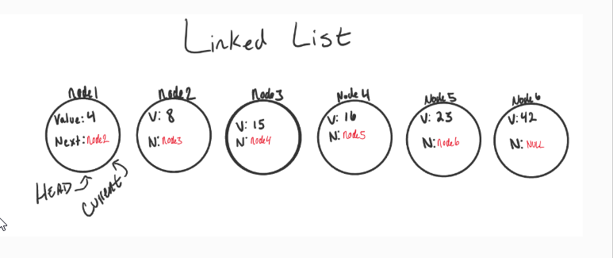

# Lists
- A Linked List is a sequence of Nodes that are connected/linked to each other. 
  - each node references the next node in the list
- two types: Singly and Doubly
- Singly: each node has only one reference to the next node
- Doubly: each node has two references, one to next node and one to previous
- Each node has a property called next
- Head: The Head is a reference type of type Node to the first node in a linked list.
- Current: the current Head reference is a reference type of type Node that is currently being looked at
- 
- A Linked list cannot be tranversed with a for or foreach loop
  - it is best to use a while loop to check the next property
- Big O time is O(n) and Big O space is O(1)
- Order of operations is VERY important to maintain the chain of Next references
- to add a new node with O(1) efficiency(adding to start of list):
  - Must replace current head
  - set current equals to head
  - use Add()
  - set newNode.next to same location as the head node is referencing
  - re-assign head to newNode
- Adding a node to the middle of a list:
  - create new node, next is null
  - use AddBefore/AddAfter
  - adjust references of adjacent and new node