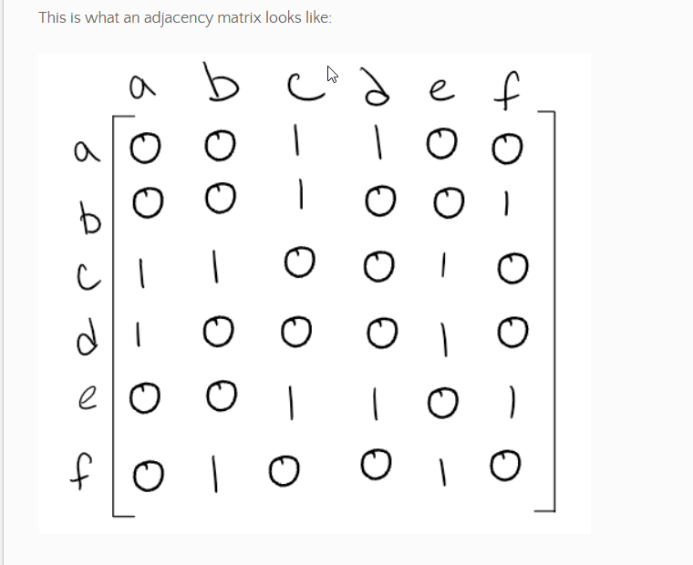
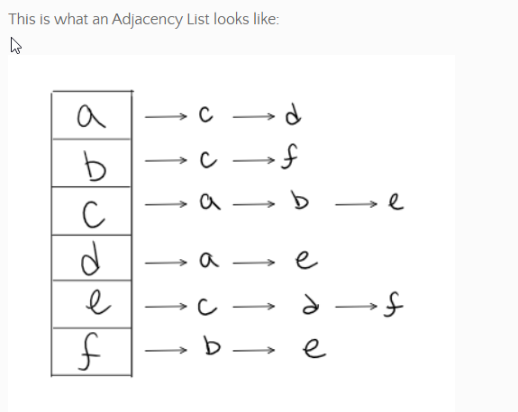

# Graphs
- A graph is a non linear data structures of vertices(node) connected by edges
- Terms
  - Vertex : A vertex, also called a “node”, is a data object that can have zero or more adjacent vertices.
  - Edge : An edge is a connection between two nodes.
  - Neighbor : The neighbors of a node are its adjacent nodes, i.e., are connected via an edge.
  - Degree : The degree of a vertex is the number of edges connected to that vertex.    
- Undirected Graph: edges are undirection or bi-directional
- Diagraph(directed graph): each node is directed at another node
- Complete Graph: every node is connected to every other node
- Connected Graph: all nodes have at least one edges
- Disconnected: not all nodes have edges
- Acyclic/Cyclic
- Graphs can be represented by 
  - adjacency matrix: A n x n matrix displaying the connections

  

  - in the above, a has connections with c,d.
  - adjacency list
   
   